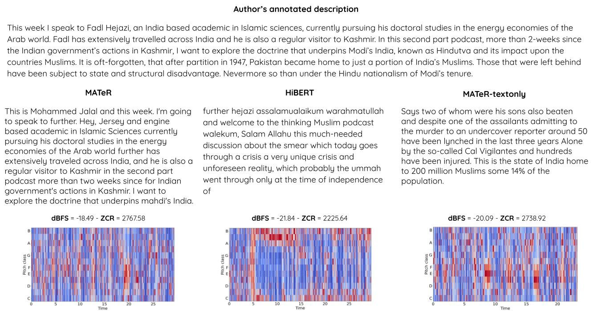
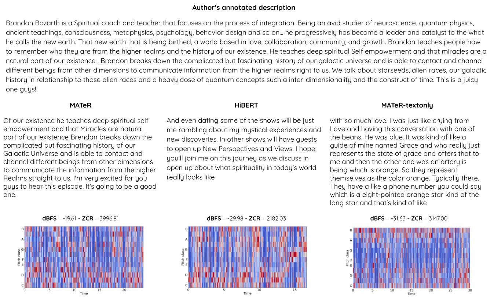
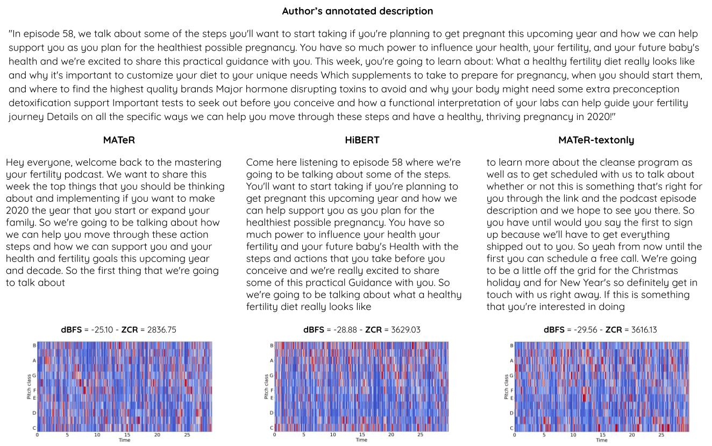
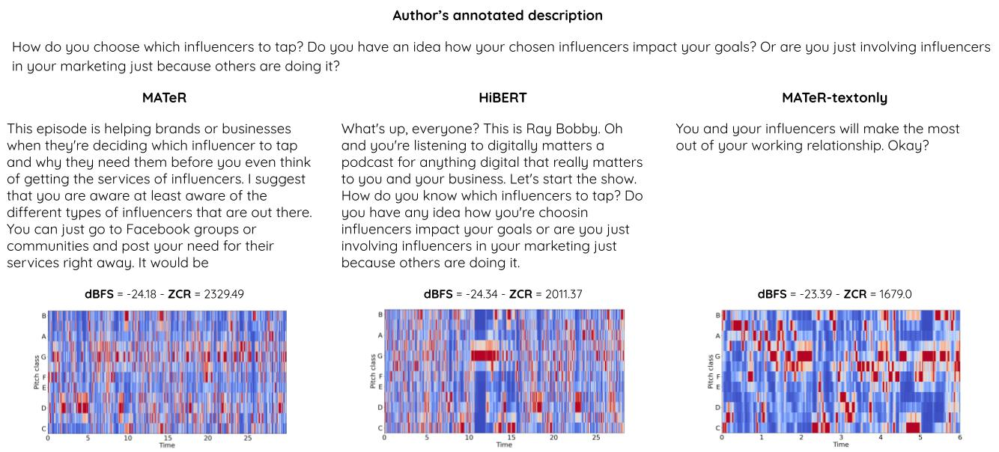

# MATeR: Multimodal Audio Text Regressor

This repository contains qualitative examples and specific details for our paper _Leveraging multimodal content for podcast summarization_ presented at ACM SAC 2022.


# Filtering advertising content from human descriptions

The model fine-tuned to classify a given sentence as containing advertising content or not is available on [🤗 Hub](https://huggingface.co/morenolq/spotify-podcast-advertising-classification). It is used as a pre-processing step to remove advertising content from text descriptions.
The model is trained on a set of ~2200 manually annotated examples. The data used to train the model can be found [here](./description_sentences_classification.tsv)

If you find the resources in this repository useful for your research please cite the following paper:

```
@inproceedings{vaiani2022leveraging,
  title={Leveraging multimodal content for podcast summarization},
  author={Vaiani, Lorenzo and La Quatra, Moreno and Cagliero, Luca and Garza, Paolo},
  booktitle={Proceedings of the 37th ACM/SIGAPP Symposium on Applied Computing},
  pages={863--870},
  year={2022}
}
```

# Qualitative examples
Demo for the paper "_Leveraging multimodal content for podcast summarization_" by Lorenzo Vaiani, Moreno La Quatra, Luca Cagliero, and Paolo Garza - published in ACM SAC 2022, 2022

- [High score examples](#high-score-examples)
  - [Example 1](#example-1-7vxiajvfnhni3t9gkw636a_3n0i2lsrlmalc25phoyjmh)
  - [Example 2](#example-2-550ZI1sg75lbNv7TXoQbec_6VAekMPV1MjUP5k465g52D)
  - [Example 3](#example-3-0L0j6X6cf3DO1Bs0D0K4Ch_0HfelmyAjA2a6Z6r7UQ6pe)
- [Low score examples](#low-score-examples)
  - [Example 1](#example-1-7lODos6uX9G0hRGtaBFgr6_5OmsBCCphxwDEpGudThv6s)
  - [Example 2](#example-2-2KBfl8eidzorW02RzQf9K8_51nmU0wf4wR6wVHACEagPs)
  - [Example 3](#example-3-51Bg4WCSE54ldyM7K4Nzff_3GSeNWxX70abttVM99zWsy)

# High score examples

Audio samples for cases where MATeR generated summaries obtain significant **higher** ROUGE-2 F1 score if compared with the best competitor. 


## Example 1 (7vXiAjVFnhNI3T9Gkw636a_3N0I2LsRLmalC25phOYJmh)




### Audio Samples (Example 1)

**MATeR**

https://user-images.githubusercontent.com/10062811/138456857-d3c46950-7a75-4ae5-9cf1-fc6aba45fdbb.mov

**HiBERT**

https://user-images.githubusercontent.com/10062811/138458086-1462223c-2a9f-456a-910d-7697271c1042.mov

**MATeR-textonly**

https://user-images.githubusercontent.com/10062811/138459025-947da371-8e68-4cb4-b894-156a6c77e4d2.mov

## Example 2 (550ZI1sg75lbNv7TXoQbec_6VAekMPV1MjUP5k465g52D)



### Audio Samples (Example 2)

**MATeR**

https://user-images.githubusercontent.com/10062811/138457006-cf647412-7bac-4f8e-b34e-90e975db93d1.mov


**HiBERT**

https://user-images.githubusercontent.com/10062811/138458119-ffab8c4e-1351-4a70-9b74-0d84e2646aca.mov


**MATeR-textonly**

https://user-images.githubusercontent.com/10062811/138459046-09dc3e50-5b89-4cd5-b3d6-cac2b98e076f.mov

## Example 3 (0L0j6X6cf3DO1Bs0D0K4Ch_0HfelmyAjA2a6Z6r7UQ6pe)


### Audio Samples (Example 3)

**MATeR**

https://user-images.githubusercontent.com/10062811/138457178-f5707111-36ac-43ef-a700-c1cf58bfd187.mov

**HiBERT**

https://user-images.githubusercontent.com/10062811/138458153-3242e556-d5f7-4463-8d61-4ce3c705c410.mov


**MATeR-textonly**

https://user-images.githubusercontent.com/10062811/138459072-564a874c-c203-42a4-b27f-e51b69d0ee08.mov


# Low score examples

Audio samples for cases where MATeR generated summaries obtain significant **lower** ROUGE-2 F1 score if compared with the best competitor. 


## Example 1 (7lODos6uX9G0hRGtaBFgr6_5OmsBCCphxwDEpGudThv6s)



### Audio Samples (Example 1)

**MATeR**

https://user-images.githubusercontent.com/10062811/138457583-7819b3b1-86d6-4e0d-8006-225caafa0bfd.mov

**HiBERT**

https://user-images.githubusercontent.com/10062811/138458244-50b78271-71e9-4012-9ef6-eb160eeebc2e.mov


**MATeR-textonly**

https://user-images.githubusercontent.com/10062811/138459122-98500051-6964-4368-98f2-71c4ac81f096.mov


## Example 2 (2KBfl8eidzorW02RzQf9K8_51nmU0wf4wR6wVHACEagPs)


### Audio Samples (Example 2)

**MATeR**

https://user-images.githubusercontent.com/10062811/138457673-7585875d-c642-4963-a404-abe1787a8caa.mov


**HiBERT**

https://user-images.githubusercontent.com/10062811/138458324-388197bf-7705-4dc4-b818-9dd4fbbdd7ef.mov


**MATeR-textonly**

https://user-images.githubusercontent.com/10062811/138459164-77b23b79-0b8e-4bef-b6d2-cd0e812c54c7.mov


## Example 3 (51Bg4WCSE54ldyM7K4Nzff_3GSeNWxX70abttVM99zWsy)



### Audio Samples (Example 3)

**MATeR**

https://user-images.githubusercontent.com/10062811/138457733-aae22364-8247-4c10-9b12-2b814dad940a.mov

**HiBERT**

https://user-images.githubusercontent.com/10062811/138458392-90460a9d-de9f-41e6-8e2e-5c1da81c1746.mov


**MATeR-textonly**

https://user-images.githubusercontent.com/10062811/138459202-21d6e3f1-f40f-44f7-93db-aa6564603723.mov


